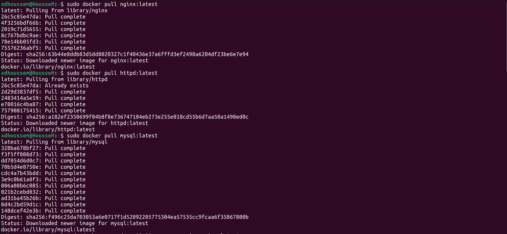
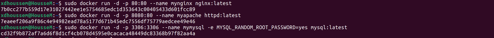
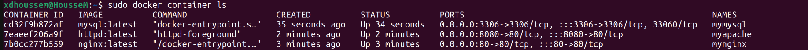
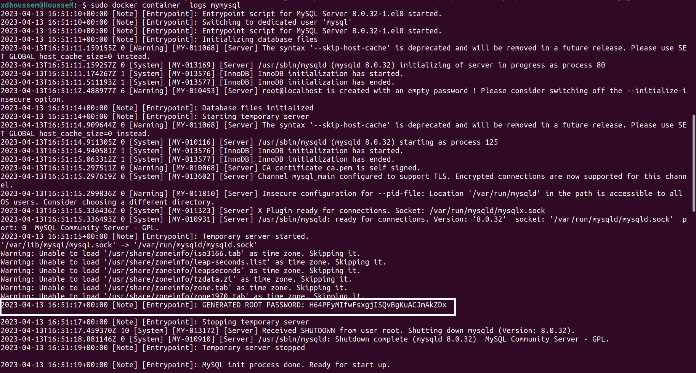
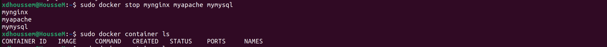
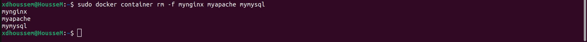

# Assigement 1: Multiple Containers

First We need To pull nginx , mysql and httpd(apache)  repository from docker hub :

```bash
sudo docker pull nginx:latest
```

```bash
sudo docker pull mysql:latest
```

```bash
sudo docker pull httpd:latest
```




**Note:** Before we start first we need to check these ports if they are used or not
If they are used, we need to determinate them


➤ Start nginx on port 80:80 :

```bash
sudo docker run -d --name mynginx -p 80:80 nginx:latest
```

➤ Start apache server on port 8080:80 :

```bash
sudo docker run -d --name myapache -p 8080:80 httpd:latest
```

➤ Start mysql on port 3306:3306 :

```bash
sudo docker run -d --name mymysql -p 3306:3306 -e MYSQL_RANDOM_ROOT_PASSWORD=yes mysql
```



Now we check our running Containers

```bash
sudo docker container ls
```




Now we use the following command to get the random root password for the MySQL container :

```bash
sudo docker container logs mymysql
```

We should see output like this:

```bash
[Entrypoint] GENERATED ROOT PASSWORD: xxxxxxxx
```



Once we have confirmed that we have the root password, we can clean up all the containers using the following commands:

```bash
sudo docker stop mynginx myapache mymysql
```


```bash
sudo docker container rm -f mynginx myapache mymysql
```

